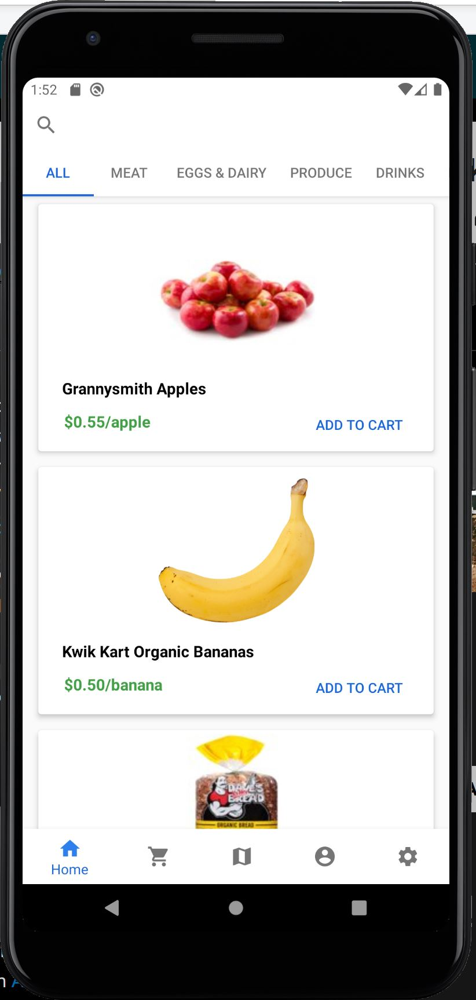

# GroceryPortal
NOTE: This project is now archived, and no changes are being made. 

Mobile application for simulating a customer grocery portal. 
Features include:
  - (Code) Databse interaction.
  - Top-level view of grocery inventory.
  - Individual tabs for specific items in the store.
  - Capability of searching the inventory. 
  - Placing items within your cart and then ordering them.
  - Notification that order has been placed. 
  - Account customization
  
As this is a project which simulates a real-world application, only the necessary requirements were met and most of the features are meant to replicate what would be the functionality. Some limitations of the database caused certain work-arounds to be executed.

# Screenshots #

</img>
</img>
</img>
</img>
</img>
</img>
</img>
</img>
</img>
</img>
</img>
</img>
</img>
</img>
</img>
</img>
</img>
</img>
